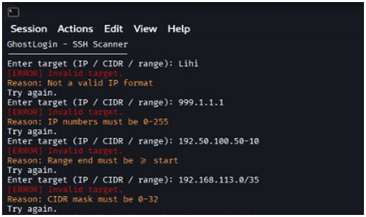
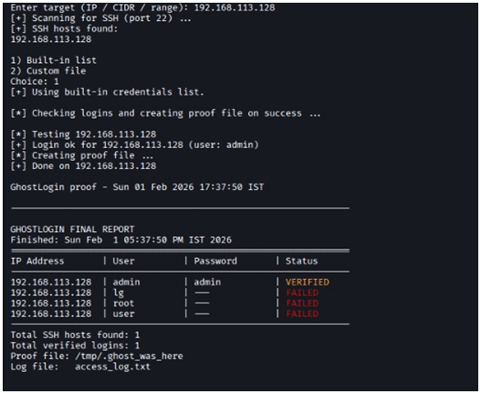
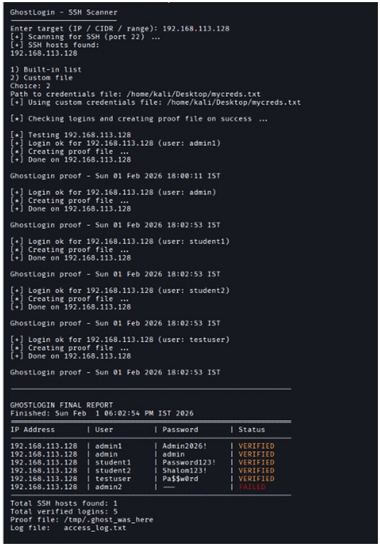
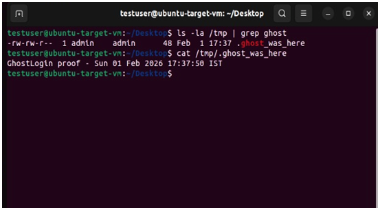

# GhostLogin
GhostLogin is a Bash-based cybersecurity tool that automates SSH exposure testing using Nmap, Hydra and sshpass.

## Features 
- Detects hosts with open SSH using Nmap
- Tests credentials using Hydra
- Automatically verifies access with SSH 
- Generates logs and reports

## Technologies 
- Bash
- Nmap
- Hydra
- SSH / sshpass
  
## Usage
Run the script:
```bash
chmod +x ghostlogin.sh
./ghostlogin.sh
```

## Screenshots

- Input Validation
The script validates the target input and prevents invalid IP formats or ranges.



- Built-in Credentials
GhostLogin can use a built-in credentials list to test SSH authentication.



- Custom Credentials File
Users can provide a custom credentials file for authentication testing.



- Proof File Verification
Successful access is verified by creating a proof file on the target machine.



## Disclaimer
This tool was created for educational purposes only and must be used only in authorized environments.
